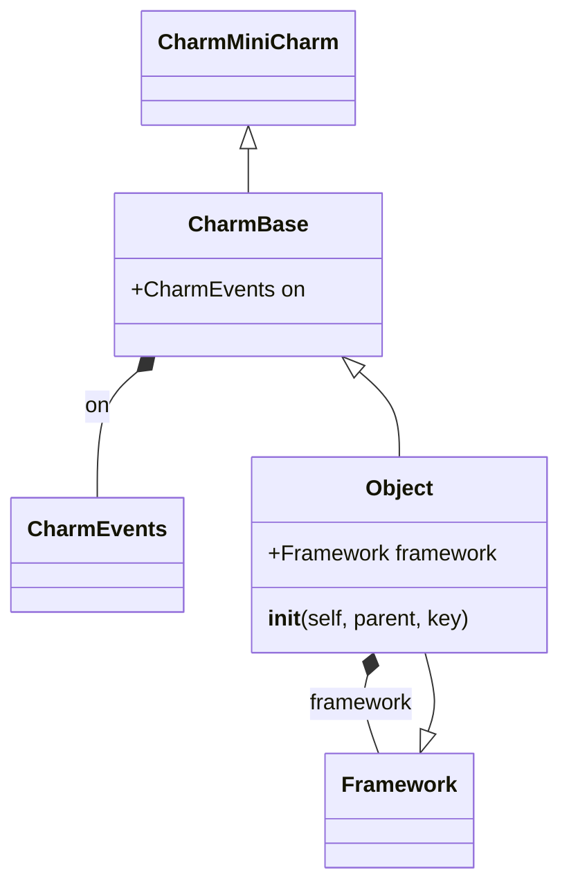
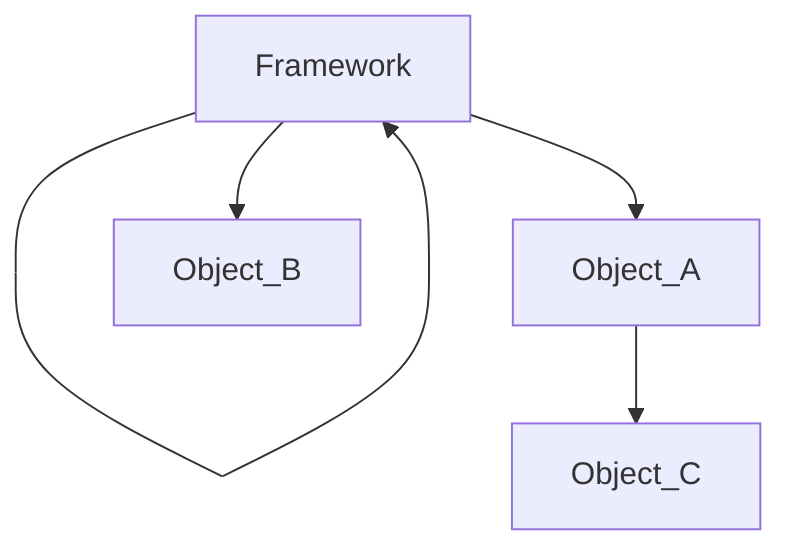

## [Build and deploy mini charm](https://juju.is/tutorials/build-and-deploy-mini-charm#1-introduction)

### Install prerequisites

#### Install LXD

```bash
sudo snap install lxd

lxd init

# Disable IPv6 for lxd
lxc network set lxdbr0 ipv6.address none
```

> lxc vs lxd?
>> lxd is the name for the managemnt software while lxc is the name for runtime.
>> Please note that the lxd package also contains lxc.

#### Install juju

```
sudo snap install juju --classic

# Check what clouds are known out-of-the-box 
juju clouds --all

# Create a juju controller in juju cloud
juju bootstrap

# List juju controllers
lxc list && juju controllers && juju clouds

```

#### Install Charmcraft

Charmchaft is a tool for build and package Charms.

```
sudo snap install charmcraft --class
```

### Init charm

```bash
mkdir charm-mini
cd charm-mini
charmcraft init
tree

# .
# ├── actions.yaml
# ├── charmcraft.yaml
# ├── config.yaml
# ├── CONTRIBUTING.md
# ├── LICENSE
# ├── metadata.yaml
# ├── README.md
# ├── requirements-dev.txt
# ├── requirements.txt
# ├── run_tests
# ├── src
# │   └── charm.py
# └── tests
#     ├── __init__.py
#         └── test_charm.py
# 
#         2 directories, 13 files
```

### Create your first charm

Let's see the file `src/charm.py`

First look at `src/charm.py`

```python
class CharmMiniCharm(CharmBase):
    """Charm the service."""

    _stored = StoredState()

    def __init__(self, *args):
        super().__init__(*args)
        self.framework.observe(self.on.httpbin_pebble_ready, self._on_httpbin_pebble_ready)
        self.framework.observe(self.on.config_changed, self._on_config_changed)
        self.framework.observe(self.on.fortune_action, self._on_fortune_action)
        self._stored.set_default(things=[])
```


To create a charm with ops(Charmed Operator Framework), you need to create a charm inhirt `opt.charm.CharmBase`.

But how this work? we need to take a look into [`CharmBase` source code](https://operator-framework.readthedocs.io/en/latest/_modules/ops/charm.html#CharmBase)


```python
class CharmBase(Object):
    """Base class that represents the charm overall.

    ...
    """

    on = CharmEvents()

    def __init__(self, framework: Framework, key: typing.Optional = None):
        super().__init__(framework, None)

        for relation_name in self.framework.meta.relations:
            relation_name = relation_name.replace('-', '_')
            self.on.define_event(relation_name + '_relation_created', RelationCreatedEvent)
            self.on.define_event(relation_name + '_relation_joined', RelationJoinedEvent)
            self.on.define_event(relation_name + '_relation_changed', RelationChangedEvent)
            self.on.define_event(relation_name + '_relation_departed', RelationDepartedEvent)
            self.on.define_event(relation_name + '_relation_broken', RelationBrokenEvent)

        for storage_name in self.framework.meta.storages:
            storage_name = storage_name.replace('-', '_')
            self.on.define_event(storage_name + '_storage_attached', StorageAttachedEvent)
            self.on.define_event(storage_name + '_storage_detaching', StorageDetachingEvent)

        for action_name in self.framework.meta.actions:
            action_name = action_name.replace('-', '_')
            self.on.define_event(action_name + '_action', ActionEvent)

        for container_name in self.framework.meta.containers:
            container_name = container_name.replace('-', '_')
            self.on.define_event(container_name + '_pebble_ready', PebbleReadyEvent)

    @property
    def app(self) -> model.Application:
        """Application that this unit is part of."""
        return self.framework.model.app

    @property
    def unit(self) -> model.Unit:
        """Unit that this execution is responsible for."""
        return self.framework.model.unit

    @property
    def meta(self) -> 'CharmMeta':
        """Metadata of this charm."""
        return self.framework.meta

    @property
    def charm_dir(self) -> pathlib.Path:
        """Root directory of the charm as it is running."""
        return self.framework.charm_dir
j
    @property
    def config(self) -> model.ConfigData:
        """A mapping containing the charm's config and current values."""
        return self.model.config
```

You can sess Charm have some property functions to return some value from framework and model.
Also use lib `ops.charm.CharmEvents` to control lifecycle.
So the basic idea here is:



And `on(CharmEvents)` is the event descriptor used to set up event handlers for corresponding events.

You can setup corresponding event in `__init__` like:

```python
def __init__(self, *args):
    super().__init__(*args)
    self.framework.observe(self.on.httpbin_pebble_ready, self._on_httpbin_pebble_ready)
    ...
```

> For the event list you can read on the documentation:
> - https://juju.is/docs/sdk/events
> - https://juju.is/docs/sdk/event--hook

TODO: juju event lifecycle with mermaid js


But what is `self.framework`? We can see it on `ops.framework.Framework`

```python
class Framework(Object):
    """Main interface to from the Charm to the Operator Framework internals."""
    ...


# Also in `ops.framework.Object`

class Object(metaclass=_Metaclass):
    """Initialize an Object as a new leaf in :class:`Framework`, identified by `key`.

    Args:
        parent: parent node in the tree.
        key: unique identifier for this object.

    Every object belongs to exactly one framework.

    Every object has a parent, which might be a framework.

    We track a "path to object," which is the path to the parent, plus the object's unique
    identifier. Event handlers use this identity to track the destination of their events, and the
    Framework uses this id to track persisted state between event executions.

    The Framework should raise an error if it ever detects that two objects with the same id have
    been created.

    """
    framework = None  # type: Framework
    handle = None  # type: Handle
    handle_kind = HandleKind()  # type: str

    def __init__(self, parent, key):
        kind = self.handle_kind
        if isinstance(parent, Framework):
            self.framework = parent
            # Avoid Framework instances having a circular reference to themselves.
            if self.framework is self:
                self.framework = weakref.proxy(self.framework)
            self.handle = Handle(None, kind, key)
        else:
            self.framework = parent.framework
            self.handle = Handle(parent, kind, key)
        self.framework._track(self)

        # TODO Detect conflicting handles here.

    ...
```

Well, when you create the Charm, you will create a tree like structure, Framework is the root node of the tree.



#### Implement charm

Now replace the code in `src/charm.py` with:

```python
#!/usr/bin/env python3
# Copyright 2021 Erik Lönroth
# See LICENSE file for licensing details.
#
# Learn more at: https://juju.is/docs/sdk

import logging
from ops.charm import CharmBase
from ops.main import main
from ops.model import MaintenanceStatus, ActiveStatus

logger = logging.getLogger(__name__)

class DeployMinimalCharm(CharmBase):
    """
        A minimalistic charm which only implements the deployment hooks

        install -> config_changed -> start
    """

    def __init__(self, *args):
        super().__init__(*args)
        self.framework.observe(self.on.install, self._on_install)
        self.framework.observe(self.on.config_changed, self._on_config_changed)
        self.framework.observe(self.on.start, self._on_start)

    def _on_install(self, event):
        """
            install is the first core hook to fire when deploying.
        """
        logger.info("Step 1/3: INSTALL")
        self.unit.status = MaintenanceStatus("Step: 1/3")

    def _on_config_changed(self, event):
        """
            config_changed is second core hook to fire when deploying.
        """
        logger.info("Step 2/3: CONFIG_CHANGED")
        self.unit.status = MaintenanceStatus("Step: 2/3")

    def _on_start(self, event):
        """
            start is the last core hook to fire when deploying.
        """
        logger.info("Step 3/3: START")
        self.unit.status = ActiveStatus("Step: 3/3")


if __name__ == "__main__":
    main(DeployMinimalCharm)
```


### Build a charm


Back to `CharmMiniCharm`, lets build a Charm now

```bash
charmcraft build

# Charmcraft will request lxc to deploy container for building the Charm.
# To check what happens on the level of lxc:

lxc list --project charmcraft

# You can clean lxc with

charmcraft clean

# list charm

ls | grep *.charm
# charm-mini_ubuntu-20.04-amd64.charm
```

We have a charm now!

But what is charm?

It's a zip file actually, you can try to unzip it && see what's inside.

```bash
unzip charm-mini_ubuntu-20.04-amd64.charm -p tmp_charm && tree tmp_charm
```

### Deploy

```bash
juju deploy ./charm-mini_ubuntu-20.04-amd64.charm
```

Monitor status && log

```bash
juju debug-log
juju status --watch 5s
```
