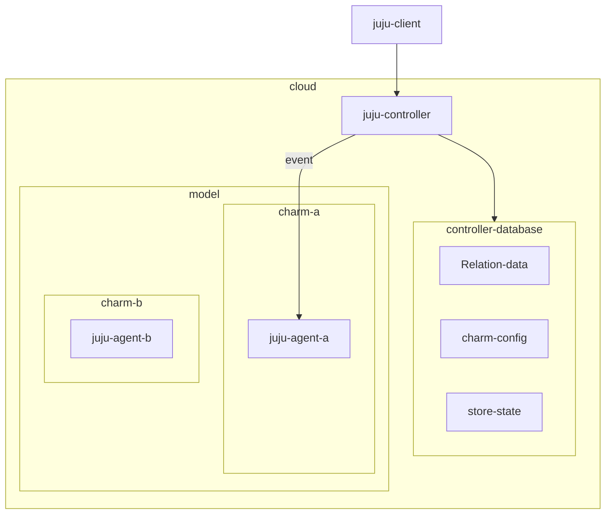
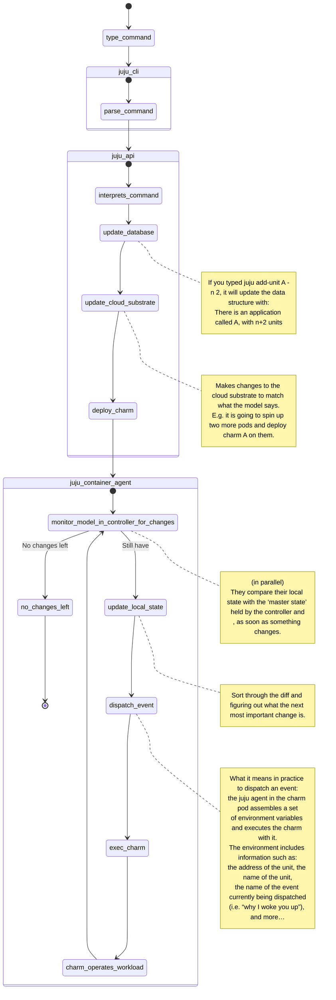

# Juju control flow

## Architecture 

- What is controller?
    - The controller is a persistent process that runs in the cloud and manages communication between you and the cloud (via juju client commands) and handles application deployment and monitoring.
    - The controller also has access to a database storing all sorts of things.

- What is model?
    - The data structure in the controller database, we’ll call the model.

- What's juju agent?
    - A Juju agent is a running instance of the jujud binary.
    - There are controller agents, unit agents, and machine agents. 
    - An agent performs different roles depending on this.
        - A controller agent is responsible for running the controller node.
        - A unit agent is responsible for managing the lifecycle of units running on the machine.
        - A machine agent manages its respective unit agents.
    - https://juju.is/docs/olm/agents

## Workload

It is important to understand the role of the controller in managing the state of a charm. When the juju agent is awakened and the charm executed, there is nothing persisted from the previous run, except for whatever is stored in the controller database.

What is then stored in the controller database?

- Relation data: a key-value mapping that can be read-written by charms according to strict access-control rules (that depend on leadership, on which application the charm belongs to, etc…). It’s important to realize that for two charms, to be related MEANS to have a dedicated relation data entry in the controller’s database which can be read and written to. There is nothing more to it than relations. Charm A is related to charm B if and only if it can read/write specific sections of that database.
- Charm config: a key-value mapping that can be read and written to by the juju cli, and is read-only for charms. CharmBase.config is the API the ops library offers to read from it.
- A charm’s stored state; i.e. a key-value mapping. StoredState is the API offered by the ops library to read/write this storage at runtime, and that is pretty much the only reliable persistence layer charms ‘natively’ offer at present. ‘Non-native’ solutions to persisting charm state could include integrating with another charm or service providing an independent database.
So the charm, at runtime, can read/write some data from the controller database and thereby access some configuration parameters to decide which codepath to execute and how to manage its workload.

## Reference

- [Talking to a workload: control flow from A to Z](https://discourse.charmhub.io/t/talking-to-a-workload-control-flow-from-a-to-z/6161)
