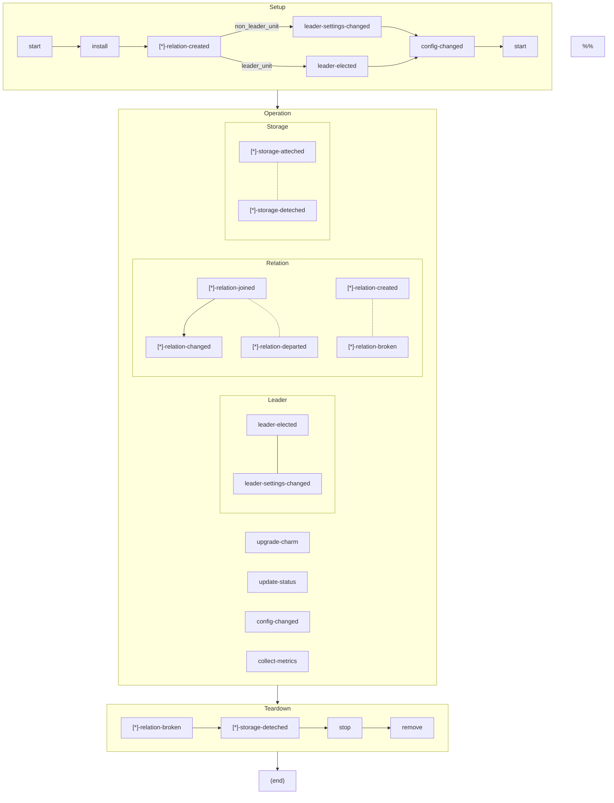

# juju life-cycle

## What is lifecycle?

$$lifecycle=hooks+states$$


## What is hook/event?

- A hook is an event handler.
- An event is a data structure that encapsulates part of the execution context of a charm

https://github.com/juju/charm/blob/master/hooks/hooks.go
[import at](https://github.com/juju/juju/blob/915c77761ef1b1f2f0abbc2c386fde54cf848f89/go.mod#L51)

### How hook run?

https://github.com/juju/juju/blob/2.9/worker/uniter/operation/runhook.go

## [Juju status](https://github.com/juju/juju/blob/2.9/core/status/status.go)

| status             | types                               |
| ------------------ | ----------------------------------- | 
| error              | machine-agent, unit-agent           | 
| started            | machine-agent, unit-agent           | 
| pending            | machine-agent                       | 
| stopped            | machine-agent                       | 
| down               | machine-agent                       | 
| allocating         | unit-agent                          | 
| rebooting          | unit-agent                          | 
| executing          | unit-agent                          | 
| idle               | unit-agent                          | 
| failed             | unit-agent                          | 
| lost               | unit-agent                          | 
| unset              | application-software, unit-software | 
| maintenance        | application-software, unit-software | 
| terminated         | application-software, unit-software | 
| unknown            | application-software, unit-software | 
| waiting            | application-software, unit-software | 
| blocked            | application-software, unit-software | 
| active             | application-software, unit-software | 
| attaching          | storage                             | 
| attached           | storage                             | 
| detaching          | storage                             | 
| detached           | storage                             | 
| available          | models                              | 
| busy               | models                              | 
| joining            | relation                            | 
| joined             | relation                            | 
| broken             | relation                            | 
| suspending         | relation                            | 
| suspended          | relation                            | 
| destroying         | common                              | 
| empty              | instance                            | 
| provisioning       | instance                            | 
| running            | instance                            | 
| provisioning error | instance                            | 
| applied            | modification                        | 


## juju lifecycle


The juju operator framework implement Observer pattern



```mermaid
flowchart TD

pre_series_upgrade(pre-series-upgrade)
post_series_upgrade(post-series-upgrade)


subgraph Operation -- Machine
pre_series_upgrade -.- post_series_upgrade
end


action("[*]-action")
custom_event("[custom_event_name]")
pebble_ready("[*]-pebble-ready")

subgraph Anytime
action
custom_event
subgraph Only on kubernetes
pebble_ready
end
end
```

## References

- https://juju.is/docs/sdk/events
- https://juju.is/docs/sdk/event--hook
- [A core lifecycle](https://discourse.charmhub.io/t/core-lifecycle-events/4455)
- [A charm’s life](https://discourse.charmhub.io/t/a-charms-life/5938#heading--legend)
- [Juju state machine documentation and visualization](https://discourse.charmhub.io/t/juju-state-machine-documentation-and-visualization/3511)
- [Juju State diagram](https://miro.com/app/board/o9J_l8NaUVU=/?share_link_id=938178796053)
- [Talking to a workload: control flow from A to Z](https://discourse.charmhub.io/t/talking-to-a-workload-control-flow-from-a-to-z/6161)

### Source code

- https://github.com/juju/juju/tree/2.9/worker/uniter/operation
- https://github.com/juju/charm/blob/master/hooks/hooks.go
