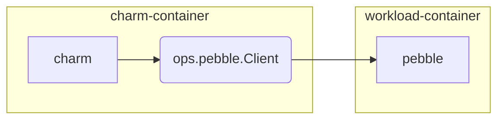
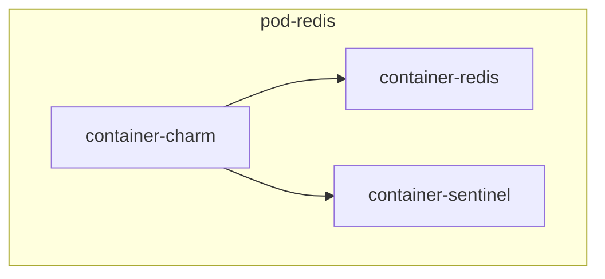
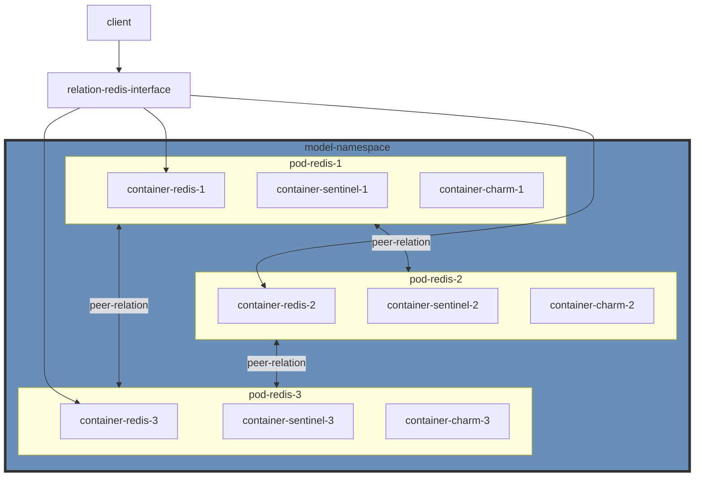

# Architecture

The things we will like to know before implementation.

## Deployment on Kubernetes pod

> [Deployment on Kubernetes pod](https://juju.is/docs/olm/deployment-of-juju-agents#deployment-on-k8s-pod)

As seen in the figure below, when a deployment is on K8S, there is no concept of a machine, but a machine agent runs in each K8S node where workloads are deployed. The main deployment entity in this case is the K8S pod, where a workload (i.e. an application unit) is deployed in a container. A unit agent runs in a sidecar container in the same pod, which runs a unit worker. This unit worker performs Juju operations on the deployed workload.


> In the case of K8S, the K8S namespace where a deployment has been made is equivalent to the Juju model for that deployment.

> In the case of K8S, Juju runs each unit of an application in a single container of a separate pod; therefore a Juju unit in a K8S provider is equivalent to a K8S pod.


## Pebble

Pebble is the recommended way for create a kubernetes charm.
Pebble is a lightweight, API-driven process supervisor designed to give workload containers something akin to an init system that will allow the charm container to interact with it.

It will been install on workload container(In this case is redis). You can see it under `/var/lib/pebble`

Juju will deploy charm in the sidecar container, with Pebble running as the workload container's ENTRYPOINT.



> [How to interact with Pebble](https://juju.is/docs/sdk/interact-with-pebble)


## Redis Sentinel

High availability for non-clustered Redis. Redis Sentinel provides high availability for Redis when not using Redis Cluster. Redis Sentinel also provides other collateral tasks such as monitoring, notifications and acts as a configuration provider for clients.

Redis Sentinel is a distributed system:

Sentinel itself is designed to run in a configuration where there are multiple Sentinel processes cooperating together. 

> https://redis.io/docs/management/sentinel/






## Kubernetes deployment

Before we start any deployment. We can take a look at what is the final result.

We can deploy redis-k8s on microk8s by juju.


> [source on github](https://github.com/canonical/redis-k8s-operator)


```sh
# Makesure we are using microk8s 
$ juju controllers

Controller           Model    User   Access     Cloud/Region         Models  Nodes    HA  Version
local-lxd            default  admin  superuser  localhost/localhost       2      1  none  2.9.36.1  
microk8s-localhost*  rrr      admin  superuser  microk8s/localhost        2      1     -  2.9.36    
```


Juju add model `rrr`, this will create a namespace `rrr` and deploy a modeloperator pod.

```sh
$ juju add-model rrr
$ microk8s kubectl get all -n rrr

NAME                                 READY   STATUS    RESTARTS      AGE
pod/modeloperator-7b46c6f886-5mxt4   1/1     Running   1 (51m ago)   17h

NAME                    TYPE        CLUSTER-IP       EXTERNAL-IP   PORT(S)     AGE
service/modeloperator   ClusterIP   10.152.183.226   <none>        17071/TCP   17h

NAME                            READY   UP-TO-DATE   AVAILABLE   AGE
deployment.apps/modeloperator   1/1     1            1           17h

NAME                                       DESIRED   CURRENT   READY   AGE
replicaset.apps/modeloperator-7b46c6f886   1         1         1       17h
```


Then use juju to deploy `redis-k8s`

```sh
$ juju deploy redis-k8s --channel edge

$ juju status

Model  Controller          Cloud/Region        Version  SLA          Timestamp
rrr    microk8s-localhost  microk8s/localhost  2.9.36   unsupported  10:46:29+08:00

App        Version  Status  Scale  Charm      Channel  Rev  Address         Exposed  Message
redis-k8s  7.0.4    active      1  redis-k8s  edge      22  10.152.183.119  no       

Unit          Workload  Agent  Address      Ports  Message
redis-k8s/0*  active    idle   10.1.238.23         
```

Use kubectl to get the information

```sh
$ microk8s kubectl get all -n rrr

NAME                                 READY   STATUS    RESTARTS      AGE
pod/modeloperator-7b46c6f886-5mxt4   1/1     Running   1 (48m ago)   17h
pod/redis-k8s-0                      3/3     Running   3 (48m ago)   17h

NAME                          TYPE        CLUSTER-IP       EXTERNAL-IP   PORT(S)     AGE
service/modeloperator         ClusterIP   10.152.183.226   <none>        17071/TCP   17h
service/redis-k8s             ClusterIP   10.152.183.119   <none>        65535/TCP   17h
service/redis-k8s-endpoints   ClusterIP   None             <none>        <none>      17h

NAME                            READY   UP-TO-DATE   AVAILABLE   AGE
deployment.apps/modeloperator   1/1     1            1           17h

NAME                                       DESIRED   CURRENT   READY   AGE
replicaset.apps/modeloperator-7b46c6f886   1         1         1       17h

NAME                         READY   AGE
statefulset.apps/redis-k8s   1/1     17h
```

The interesting thing is that deploy `redis-k8s` do not create any kubernetes deployment resource.
It just create a pod `pod/redis-k8s-0`, which has three pods: `charm`, `redis` and `sentinel`.

```sh
# List containers inside the pod
$ microk8s kubectl get pods redis-k8s-0 -n rrr -o jsonpath='{.spec.containers[*].name}'
charm redis sentinel
```

The basic lifecycle is it will use init container to initialize the pebble layer and containeragent.

```sh
# container charm
$ microk8s kubectl -n rrr exec -it redis-k8s-0 -c charm -- /bin/bash            

$ root@redis-k8s-0:/var/lib/juju ps aux
USER         PID %CPU %MEM    VSZ   RSS TTY      STAT START   TIME COMMAND
root           1  0.0  0.0 719336 10404 ?        Ssl  02:53   0:03 /charm/bin/pebble run --http :38812 --verbose
root          16  0.0  0.1 773892 52136 ?        Sl   02:53   0:06 /charm/bin/containeragent unit --data-dir /var/lib/juju --append-env PATH=$PATH:/charm/bin --show-log --charm-modified-version 0
root        2565  0.0  0.0   4248  3332 pts/0    Ss   05:15   0:00 /bin/bash
root        2573  0.0  0.0   5900  2776 pts/0    R+   05:15   0:00 ps aux

# container redis

$ microk8s kubectl -n rrr exec -it redis-k8s-0 -c redis -- /bin/bash

$ root@redis-k8s-0:/data ps aux
USER         PID %CPU %MEM    VSZ   RSS TTY      STAT START   TIME COMMAND
root           1  0.0  0.0 718824 10448 ?        Ssl  02:53   0:02 /charm/bin/pebble run --create-dirs --hold --http :38813 --verbose
redis         14  0.1  0.0  53484  8712 ?        Sl   02:53   0:15 redis-server 0.0.0.0:6379
root          31  0.0  0.0   4624  3704 pts/0    Ss   05:16   0:00 /bin/bash
root          39  0.0  0.0   7060  1548 pts/0    R+   05:16   0:00 ps aux


# container sentinel

$ microk8s kubectl -n rrr exec -it redis-k8s-0 -c sentinel -- /bin/bash

$ root@redis-k8s-0:/data ps aux
USER         PID %CPU %MEM    VSZ   RSS TTY      STAT START   TIME COMMAND
root           1  0.0  0.0 718888 10492 ?        Ssl  02:53   0:03 /charm/bin/pebble run --create-dirs --hold --http :38814 --verbose
redis         15  0.2  0.0  53484  8440 ?        Sl   02:53   0:23 redis-server *:26379 [sentinel]
root          31  0.0  0.0   4624  3752 pts/1    Ss   05:23   0:00 /bin/bash
root          42  0.0  0.0   7060  1648 pts/1    R+   05:23   0:00 ps aux

```
