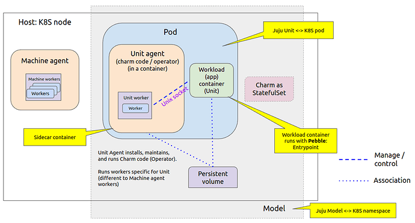
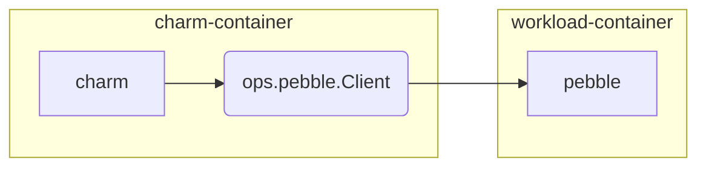
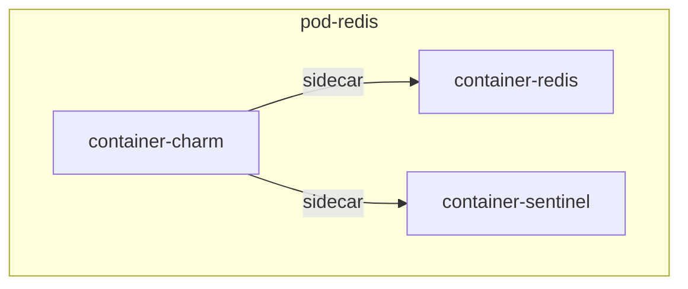
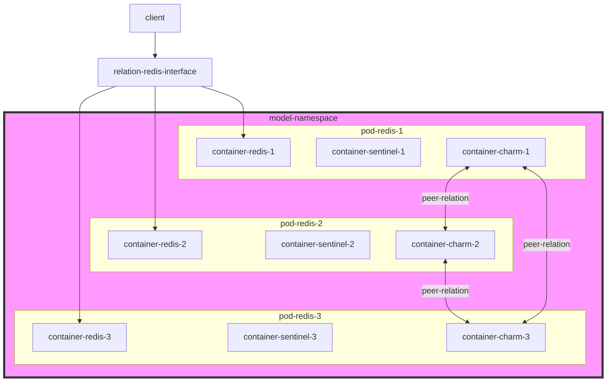

# Architecture

The things we will like to know before implementation.

## Deployment on Kubernetes pod

> [Deployment on Kubernetes pod](https://juju.is/docs/olm/deployment-of-juju-agents#deployment-on-k8s-pod)

As seen in the figure below, when a deployment is on K8S, there is no concept of a machine, but a machine agent runs in each K8S node where workloads are deployed. The main deployment entity in this case is the K8S pod, where a workload (i.e. an application unit) is deployed in a container. A unit agent runs in a sidecar container in the same pod, which runs a unit worker. This unit worker performs Juju operations on the deployed workload.

> In the case of K8S, the K8S namespace where a deployment has been made is equivalent to the Juju model for that deployment.

> In the case of K8S, Juju runs each unit of an application in a single container of a separate pod; therefore a Juju unit in a K8S provider is equivalent to a K8S pod.

## Pubble

Pebble is the recommended way for create a kubernetes charm.
Pebble is a lightweight, API-driven process supervisor designed to give workload containers something akin to an init system that will allow the charm container to interact with it.

It will been install on workload container(In this case is redis). You can see it under `/var/lib/pebble`

Juju will deploy charm in the sidecar container, with Pebble running as the workload container's ENTRYPOINT.

> [How to interact with Pebble](https://juju.is/docs/sdk/interact-with-pebble)

## Redis Sentinel

