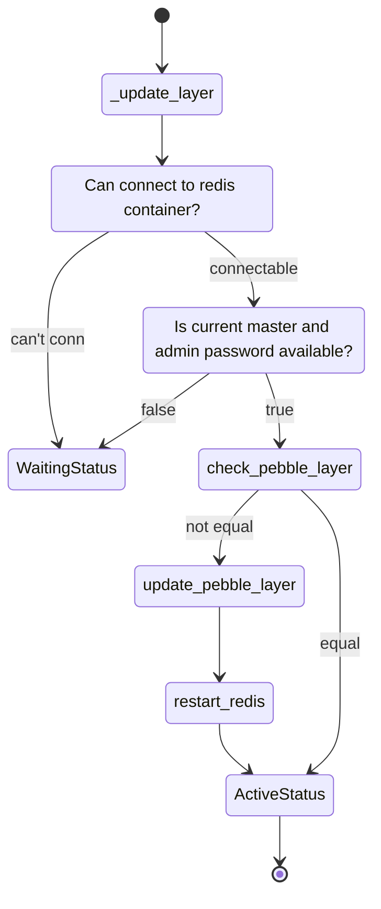

# Deployment - Pubble

> Introduction of pubble is in [Architecture](./architecture.md)

So here we need to create a pebble layer which be a supervisor of redis server.


## observer register event

```python
class RedisK8sCharm(CharmBase):
    ...

    def __init__(self, *args):
        ...

        self.framework.observer(self.on.redis_pebble_ready, self._redis_pebble_ready)

    def _redis_pebble_ready(self, event) -> None:
        """Handle the pebble_ready event.

        Updated the Pebble layer if needed.
        """
        pass
```

We register a event `redis_pebble_ready` which handle by function `_redis_pebble_ready`


```python
from ops.model import ActiveStatus

class RedisK8sCharm(CharmBase):
    ...

    def _redis_pebble_ready(self, event) -> None:
        ...
        self._store_certificates()
        self._update_layer()

        # update_layer will set Waiting status if Pebble is not ready
        if not isinstance(self.unit.status, ActiveStatus):
            event.defer()
            return
```


## Fetch resource from model resources, and push to container

Implement `_store_certificates` function

```python
import logging
from typing import Optional, List
from pathlib import Path
from ops.model import ActiveStatus, ModelError

logger = logging.getLogger(__name__)


class RedisK8sCharm(CharmBase):
    ...

    def __init__(self, *args):

        ...

        self._storage_path = self.meta.storages["database"].location

    def _redis_pebble_ready(self, event) -> None:
        ...

        self._store_certificates()

        ...

    def _store_certificates(self) -> None:
        """Copy the TLS certificates to the redis container."""
        # Get a list of valid paths
        cert_paths = list(filter(None, self._certificates))
        container = self.unit.get_container("redis")

        # Copy the files from the resources location to the redis container.
        for cert_path in cert_paths:
            with open(cert_path, "r") as f:
                container.push(
                    (f"{self._storage_path}/{cert_path.name}"),
                    f,
                    make_dirs=True,
                    permissions=0o600,
                    user="redis",
                    group="redis",
                )

    def _certificates(self) -> List[Optional[Path]]:
        """Paths of the certificate files.

        Returns:
            A list with the paths of the certificates or None where no path can be found
        """
        resources = ["cert-file", "key-file", "ca-cert-file"]
        return [self._retrieve_resource(res) for res in resources]

    def _retrieve_resource(self, resource: str) -> Optional[Path]:
        """Check that the resource exists and return it.

        Returns:
            Path of the reosurce or None
        """
        try:
            # Fetch the resource path
            return self.model.resources.fetch(resource)
        except (ModelError, NameError) as e:
            logger.info(e)
            return None
```

> [juju SDK - storage](https://juju.is/docs/sdk/storage)

## Update pebble layer

Create/update pebble redis layer, it will need peer's admin password(This part will be implement later).

The state diagram, you can see the basic flow how operator bootstrap redis service by using pebble:




`src/charm.py`

```python

from ops.model import WaitingStatus, Relation
from ops.pebble import Layer

...

class RedisK8sCharm(CharmBase):
    ...

    def _update_layer(self) -> None:
        """Update the Pebble layer.

        Checks the current container Pebble layer. If the layer is different
        to the new one, Pebble is updated. If not, nothing needs to be done.
        """
        container = self.unit.get_container("redis")

        if not container.can_connect():
            self.unit.status = WaitingStatus("Waiting for Pebble in workload container")
            return
        if not self._valid_app_databag():
            self.unit.status = WaitingStatus("Waiting for peer data to be updated")
            return

        # Get current config
        current_layer = container.get_plan()

        # Create the new config layer
        new_layer = self._redis_layer()

        # Update the Pebble configuration Layer
        if current_layer.services != new_layer.services:
            container.add_layer("redis", new_layer, combine=True)
            logger.info("Added updated layer 'redis' to Pebble plan")
            container.restart("redis")
            logger.info("Restarted redis service")

        self.unit.status = ActiveStatus()

    def _redis_layer(self) -> Layer:
        """Create the Pebble configuration layer for Redis.

        Returns:
            A `ops.pebble.Layer` object with the current layer options
        """
        layer_config = {
            "summary": "Redis layer",
            "description": "Redis layer",
            "services": {
                "redis": {
                    "command": f"redis-server {self._redis_extra_flags()}",
                    "user": "redis",
                    "group": "redis",
                    "startup": "enabled",
                }
            },
        }
        return Layer(layer_config)

    def _redis_extra_flags(self) -> str:
        """Generate the REDIS_EXTRA_FLAGS environment variable for the container.

        Will check config options to decide the extra commands passed at the
        redis-server service.
        """
        extra_flags = [
            f"--requirepass {self._get_password()}",
            "--bind 0.0.0.0",
            f"--masterauth {self._get_password()}",
            f"--replica-announce-ip {self.unit_pod_hostname}",
        ]

        if self.config["enable-tls"]:
            extra_flags += [
                f"--tls-port {REDIS_PORT}",
                "--port 0",
                "--tls-cert-file {self._storage_path}/redis.crt",
                "--tls-key-file {self._storage_path}/redis.key",
                "--tls-ca-cert-file {self._storage_path}/ca.crt",
            ]
        # Check that current unit is master
        if self.current_master != self.unit_pod_hostname:
            extra_flags += [f"--replicaof {self.current_master} {REDIS_PORT}"]

            if self.config["enable-tls"]:
                extra_flags += ["--tls-replication yes"]
        return " ".join(extra_flags)

    def _valid_app_databag(self) -> bool:
        """Check if the peer databag has been populated.

        Returns:
            bool: True if the databag has been popilated, false otherwise
        """
        password = self._get_password()
        return bool(password and self.current_master)

    def _get_password(self) -> Optional[str]:
        """Get the current admin password for Redis.

        Returns:
            String with the password
        """
        data = self._peers.data[self.app]
        return data.get(PEER_PASSWORD_KEY)

    @property
    def _peers(self) -> Optional[Relation]:
        """Fetch the peer relation.

        Returns:
            An `ops.model.Relation` object representing the peer relation.
        """
        return self.model.get_relation(PEER)
```

Add `enable-tls` to juju config.

`./config.yaml`

```yaml
options:
  enable-tls:
    default: false
    type: boolean
    description: >
      Enabling TLS for the standard port of redis-server.
      This option should be enabled after uploading the
      corresponding TLS files as resources.
```
