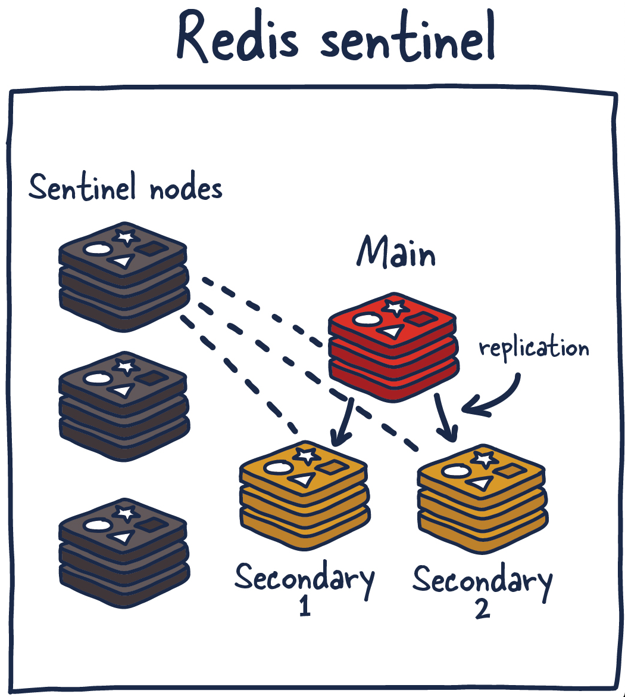

# Deployment - Redis Sentinel



We are not going to explan **what is redis sentinel** here.

> Redis Sentinel document: https://redis.io/docs/management/sentinel/

Here we are going to show you how to implement sentinel as a container in juju.

First we will create another Juju Operator Object class as the handler for the sentinel container that we register in the metadata.yaml before. The Sentinel class is inherit from `ops.framework.Object`, we can take a look at it's source code here:


```python
class Object(metaclass=_Metaclass):
    """Initialize an Object as a new leaf in :class:`Framework`, identified by `key`.

    Args:
        parent: parent node in the tree.
        key: unique identifier for this object.

    Every object belongs to exactly one framework.

    Every object has a parent, which might be a framework.

    We track a "path to object," which is the path to the parent, plus the object's unique
    identifier. Event handlers use this identity to track the destination of their events, and the
    Framework uses this id to track persisted state between event executions.

    The Framework should raise an error if it ever detects that two objects with the same id have
    been created.

    """
    handle_kind = HandleKind()  # type: str

    if TYPE_CHECKING:
        # to help the type checker and IDEs:
        # all these are guaranteed to be set at runtime.
        @property
        def on(self) -> 'ObjectEvents': ...  # noqa

    def __init__(self, parent: Union['Framework', 'Object'], key: Optional[str]):
        self.framework = None  # type: Framework # noqa
        self.handle = None  # type: Handle # noqa

        kind = self.handle_kind
        if isinstance(parent, Framework):
            self.framework = parent
            # Avoid Framework instances having a circular reference to themselves.
            if self.framework is self:
                self.framework = weakref.proxy(self.framework)
            self.handle = Handle(None, kind, key)
        else:
            self.framework = parent.framework
            self.handle = Handle(parent, kind, key)
        self.framework._track(self)  # noqa

        # TODO Detect conflicting handles here.

    @property
    def model(self) -> 'Model':
        """Shortcut for more simple access the model."""
        return self.framework.model
```

The Object is been use to *Initialize an Object as a new leaf in :class:`Framework`, identified by `key`*. In our case the framework is `RedisK8sCharm` and the leaf is `Sentinel` which identified by key `sentinel`.

> [Operator Object github source](https://github.com/canonical/operator/blob/da4a0eccdadf3539b04441154a5f1bcc56aa5480/ops/framework.py#L404)


Here is the implementation:

`./src/charm.py`

Register charm to *Sentinel*.

```python
from sentinel import Sentinel

...

class RedisK8sCharm(CharmBase):
    ...

    def __init__(self, *args):

        ...

        self.sentinel = Sentinel(self)
```

`./src/sentinel.py`

```python
from ops.framework import Object

class Sentinel(Object):
    """Sentinel class.

    Deploys sentinel in a separate container, handling the specific events
    related to the Sentinel process.
    """

    def __init__(self, charm) -> None:
        super().__init__(charm, "sentinel")

        self.charm = charm
```

## Sentinel pebble ready event

Then just like the way we implement *pebble_ready* event before, we need to register pebble to handle the sentinel service. The main different is in function `_sentinel_layer`, which create a pebble layer for the Redis sentinel.

> Also important that the name of the event we need to handle is `sentinel_pebble_ready`.


`./src/sentinel.py`

```python
"""Charm code for sentinel service.

Sentinel provides high availability for Redis.
"""

import logging
from contextlib import contextmanager
from math import floor
from typing import Optional

from jinja2 import Template
from ops.framework import Object
from ops.model import ActiveStatus, WaitingStatus
from ops.pebble import Layer
from redis import ConnectionError, Redis, ResponseError, TimeoutError

logger = logging.getLogger(__name__)


class Sentinel(Object):
    """Sentinel class.

    Deploys sentinel in a separate container, handling the specific events
    related to the Sentinel process.
    """

    def __init__(self, charm) -> None:
        super().__init__(charm, "sentinel")

        self.charm = charm
        self.framework.observe(charm.on.sentinel_pebble_ready, self._sentinel_pebble_ready)

    def _sentinel_pebble_ready(self, event) -> None:
        """Handle pebble ready event for sentinel container."""
        self._update_sentinel_layer()

        # update layer should leave the unit in active status
        if not isinstance(self.charm.unit.status, ActiveStatus):
            event.defer()
            return

    def _update_sentinel_layer(self) -> None:
        """Update the Pebble layer.

        Checks the current container Pebble layer. If the layer is different
        to the new one, Pebble is updated. If not, nothing needs to be done.
        """
        container = self.charm.unit.get_container("sentinel")

        if not container.can_connect():
            self.charm.unit.status = WaitingStatus("Waiting for Pebble in sentinel container")
            return

        if not self.charm._valid_app_databag():
            self.charm.unit.status = WaitingStatus("Databag has not been populated")
            return

        # copy sentinel config file to the container
        self._render_sentinel_config_file()

        # Create the new config layer
        new_layer = self._sentinel_layer()

        # Update the Pebble configuration Layer
        container.add_layer("sentinel", new_layer, combine=True)
        container.replan()

    def _sentinel_layer(self) -> Layer:
        """Create the Pebble configuration layer for Redis Sentinel.

        Returns:
            A `ops.pebble.Layer` object with the current layer options
        """
        layer_config = {
            "summary": "Sentinel layer",
            "description": "Sentinel layer",
            "services": {
                "sentinel": {
                    "override": "replace",
                    "summary": "Sentinel service",
                    "command": f"redis-server {SENTINEL_CONFIG_PATH} --sentinel",
                    "user": "redis",
                    "group": "redis",
                    "startup": "enabled",
                }
            },
        }
        return Layer(layer_config)

    def _render_sentinel_config_file(self) -> None:
        """Render the Sentinel configuration file."""
        # open the template file
        with open("templates/sentinel.conf.j2", "r") as file:
            template = Template(file.read())
        # render the template file with the correct values.
        rendered = template.render(
            hostname=self.charm.unit_pod_hostname,
            master_name=self.charm._name,
            sentinel_port=SENTINEL_PORT,
            redis_master=self.charm.current_master,
            redis_port=REDIS_PORT,
            quorum=self.expected_quorum,
            master_password=self.charm._get_password(),
            sentinel_password=self.charm.get_sentinel_password(),
        )
        self._copy_file(SENTINEL_CONFIG_PATH, rendered, "sentinel")

    def _copy_file(self, path: str, rendered: str, container: str) -> None:
        """Copy a string to a path on a container.

        # TODO: Candidate to be extracted to a lib?
        """
        container = self.charm.unit.get_container(container)
        if not container.can_connect():
            logger.warning("Can't connect to {} container".format(container))
            return

        # NOTE: Creating the dir with correct user:group and permissions is needed
        # until https://github.com/canonical/pebble/issues/124 is fixed.
        if not container.exists(CONFIG_DIR):
            container.make_dir(
                CONFIG_DIR,
                make_parents=True,
                permissions=0o770,
                user="redis",
                group="redis",
            )

        container.push(
            path,
            rendered,
            permissions=0o660,
            user="redis",
            group="redis",
        )

    @property
    def expected_quorum(self) -> int:
        """Get the current expected quorum number."""
        return floor(self.charm.app.planned_units() / 2) + 1

    @property
    def in_majority(self) -> bool:
        """Check that sentinel can reach quorum."""
        majority = False
        with self.sentinel_client() as sentinel:
            try:
                response = sentinel.execute_command(f"SENTINEL CKQUORUM {self.charm._name}")
                if response.startswith("OK"):
                    logger.info("Own sentinel instance can reach quorum")
                    majority = True
            except (ConnectionError, ResponseError) as e:
                logger.warning("No quorum can be reached: {}".format(e))

        return majority

    @contextmanager
    def sentinel_client(self, hostname="localhost", timeout=SOCKET_TIMEOUT) -> Redis:
        """Creates a Redis client on a given hostname.

        Args:
            hostname: String with the hostname to connect to, defaults to localhost
            timeout: int with the number of seconds for timeout on connection

        Returns:
            Redis: redis client connected to a sentinel instance
        """
        client = Redis(
            host=hostname,
            port=SENTINEL_PORT,
            password=self.charm.get_sentinel_password(),
            socket_timeout=timeout,
            decode_responses=True,
        )
        try:
            yield client
        finally:
            client.close()

```


`./templates/sentinel.conf.j2`

```conf
port {{ sentinel_port }}
sentinel monitor {{ master_name }} {{ redis_master }} {{ redis_port }} {{ quorum }}
sentinel down-after-milliseconds {{ master_name }} 5000
sentinel failover-timeout {{ master_name }} 30000
sentinel parallel-syncs {{ master_name }} 1


sentinel auth-pass {{ master_name }} {{ master_password }}

requirepass {{ sentinel_password }}

sentinel announce-hostnames yes
sentinel resolve-hostnames yes
sentinel announce-ip {{ hostname }}
replica-announce-ip {{ hostname }}
```

### Sentinel helper function

Then implement a helper function that will be used later when we need to get master information from `RedisK8sCharm`.

```python
class Sentinel(Object):
    ...

    def get_master_info(self, host="localhost") -> Optional[dict]:
        """Connect to sentinel and return the current master."""
        with self.sentinel_client(host) as sentinel:
            try:
                # get sentinel info about the master
                master_info = sentinel.execute_command(f"SENTINEL MASTER {self.charm._name}")

                # NOTE: master info from redis comes like a list:
                # ['key1', 'value1', 'key2', 'value2', ...]
                # this creates a dictionary in a more readable form.
                return dict(zip(master_info[::2], master_info[1::2]))

            except (ConnectionError, TimeoutError) as e:
                logger.error("Error when connecting to sentinel: {}".format(e))

        return None
```
