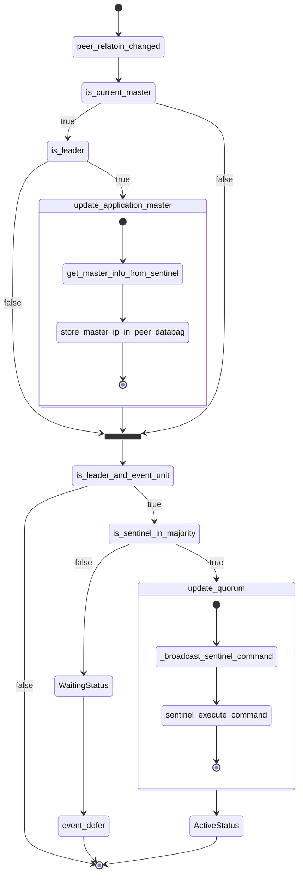
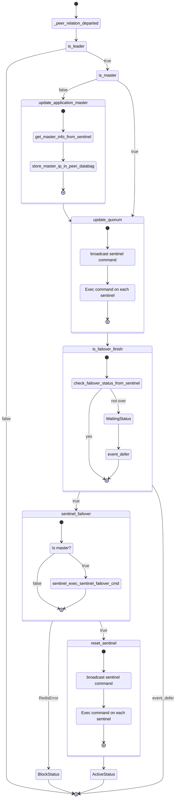

# Deployment - redis-peers interface

Peer relation is the recommended way to implement the relation for those distributed system like MongoDB, PostgreSQL, and ElasticSearch where clusters must exchange information amongst one another to perform proper clustering.

> More details: [Peer relation](https://juju.is/docs/sdk/relations#heading--peer-relations)

We need to handle `relation_departed` and `relation_changed` event for our peers relation.


## peer_relation_changed



```python
...

class RedisK8sCharm(CharmBase):
    ...

    def __init__(self, *args):
        ...

        self.framework.observe(self.on[PEER].relation_changed, self._peer_relation_changed)
        self.framework.observe(self.on[PEER].relation_departed, self._peer_relation_departed)

    def _peer_relation_changed(self, event):
        """Handle relation for joining units."""
        if not self._check_master():
            if self.unit.is_leader():
                # Update who the current master is
                self._update_application_master()

        if not (self.unit.is_leader() and event.unit):
            return

        if not self.sentinel.in_majority:
            self.unit.status = WaitingStatus("Waiting for majority")
            event.defer()
            return

        # Update quorum for all sentinels
        self._update_quorum()

        self.unit.status = ActiveStatus()

    def _check_master(self) -> bool:
        """Connect to the current stored master and query role."""
        with self._redis_client(hostname=self.current_master) as redis:
            try:
                result = redis.execute_command("ROLE")
            except (ConnectionError, TimeoutError) as e:
                logger.warning("Error trying to check master: {}".format(e))
                return False

            if result[0] == "master":
                return True

        return False

    def _update_application_master(self) -> None:
        """Use Sentinel to update the current master hostname."""
        info = self.sentinel.get_master_info()
        logger.debug(f"Master info: {info}")
        if info is None:
            logger.warning("Could not update current master")
            return

        self._peers.data[self.app][LEADER_HOST_KEY] = info["ip"]

    def _update_quorum(self) -> None:
        """Connect to all Sentinels deployed to update the quorum."""
        command = f"SENTINEL SET {self._name} quorum {self.sentinel.expected_quorum}"
        self._broadcast_sentinel_command(command)

    def _broadcast_sentinel_command(self, command: str) -> None:
        """Broadcast a command to all sentinel instances.

        Args:
            command: string with the command to broadcast to all sentinels
        """
        hostnames = [self._k8s_hostname(unit.name) for unit in self._peers.units]
        # Add the own unit
        hostnames.append(self.unit_pod_hostname)

        for hostname in hostnames:
            with self.sentinel.sentinel_client(hostname=hostname) as sentinel:
                try:
                    logger.debug("Sending {} to sentinel at {}".format(command, hostname))
                    sentinel.execute_command(command)
                except (ConnectionError, TimeoutError) as e:
                    logger.error("Error connecting to instance: {} - {}".format(hostname, e))

    @contextmanager
    def _redis_client(self, hostname="localhost") -> Redis:
        """Creates a Redis client on a given hostname.

        All parameters are passed, will default to the same values under `Redis` constructor

        Returns:
            Redis: redis client
        """
        ca_cert_path = self._retrieve_resource("ca-cert-file")
        client = Redis(
            host=hostname,
            port=REDIS_PORT,
            password=self._get_password(),
            ssl=self.config["enable-tls"],
            ssl_ca_certs=ca_cert_path,
            decode_responses=True,
            socket_timeout=SOCKET_TIMEOUT,
        )
        try:
            yield client
        finally:
            client.close()
```

## peer_relation_departed

Handle relation for leaving units.


