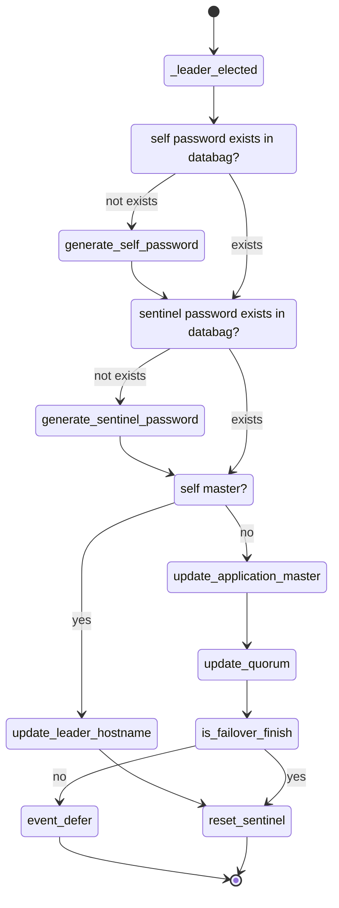

# Deployment - leader elected

In Juju, every application is guaranteed to have exactly one leader at any time. This is true independent of the charm's author's actions; whether or not you implement the hooks or use the tools, the juju controller will elect a leader when a charm is deployed. Units that hold leader status should not assume they will retain it, a new leader can be elected at any time.

> [juju Leader](https://juju.is/docs/sdk/leadership)

The leader-elected event is emitted for a unit that is elected as leader. Together with leader-settings-changed, it is one of two “leadership events”. A unit receiving this event can be guaranteed that it will have leadership for approximately 30 seconds (from the moment the event is received). 

After that time, juju might have elected a different leader. The same holds if the unit checks leadership by Unit.is_leader(): if the result is True, then the unit can be ensured that it has leadership for the next 30s.

> [leader-elected event](https://juju.is/docs/sdk/leader-elected-event)

In this leader_elected event, we will make sure the redis password and sentinel password are been stored in the peer relation databag. Later store the master host key to the databag also.gtkjkjj



> [juju defer event](https://juju.is/docs/sdk/deferring-events-details-and-dilemmas)

`src/sentinel.py`

`src/charm.py`

```python

...

class RedisK8sCharm(CharmBase):
    ...

    def __init__(self, *args):

        self.sentinel = Sentinel(self)
        ...
        self.framework.observe(self.on.leader_elected, self._leader_elected)

    def _leader_elected(self, event) -> None:
        """Handle the leader_elected event.

        If no passwords exist, new ones will be created for accessing Redis/Sentinel.
        This passwords will be stored on the peer relation databag.

        Additionally, there is a check for departing juju leader on scale-down operations.
        """
        if not self._get_password():
            logger.info("Creating password for application")
            self._peers.data[self.app][PEER_PASSWORD_KEY] = self._generate_password()

        if not self.get_sentinel_password():
            logger.info("Creating sentinel password")
            self._peers.data[self.app][SENTINEL_PASSWORD_KEY] = self._generate_password()
        # NOTE: if current_master is not set yet, the application is being deployed for the
        # first time. Otherwise, we check for failover in case previous juju leader was redis
        # master as well.
        if self.current_master is None:
            logger.info(
                "Initial replication, setting leader-host to {}".format(self.unit_pod_hostname)
            )
            self._peers.data[self.app][LEADER_HOST_KEY] = self.unit_pod_hostname
        else:
            # TODO extract to method shared with relation_departed
            self._update_application_master()
            self._update_quorum()
            try:
                self._is_failover_finished()
            except (RedisFailoverCheckError, RedisFailoverInProgressError):
                logger.info("Failover didn't finish, deferring")
                event.defer()
                return

            logger.info("Resetting sentinel")
            self._reset_sentinel()

    def get_sentinel_password(self) -> Optional[str]:
        """Get the current password for sentinel.

        Returns:
            String with the password
        """
        data = self._peers.data[self.app]
        return data.get(SENTINEL_PASSWORD_KEY)
```
