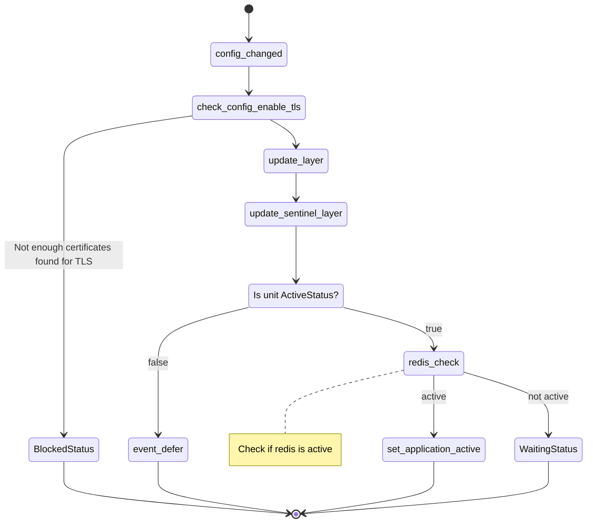

# Deployment - basic event handlers

We will implement 3 basic events `config_changed`, `upgrade_charm`, and `update_status` here.

## Config changed



`./src/charm.py`

```python
...
from ops.charm import ActionEvent
...

class RedisK8sCharm(CharmBase):
    ...

    def __init__(self, *args):

        ...

        self.framework.observe(self.on.config_changed, self._config_changed)

        ...

    def _config_changed(self, event: EventBase) -> None:
        """Handle config_changed event.

        Updates the Pebble layer if needed. Finally, checks the redis service
        updating the unit status with the result.
        """
        # Check that certificates exist if TLS is enabled
        if self.config["enable-tls"] and None in self._certificates:
            logger.warning("Not enough certificates found for TLS")
            self.unit.status = BlockedStatus("Not enough certificates found")
            return

        self._update_layer()
        self.sentinel._update_sentinel_layer()

        # update_layer will set a Waiting status if Pebble is not ready
        if not isinstance(self.unit.status, ActiveStatus):
            event.defer()
            return

        self._redis_check()

    def _redis_check(self) -> None:
        """Checks if the Redis database is active."""
        try:
            with self._redis_client() as redis:
                info = redis.info("server")
            version = info["redis_version"]
            self.unit.status = ActiveStatus()
            self.unit.set_workload_version(version)
            if self.unit.is_leader():
                self.app.status = ActiveStatus()
            return True
        except RedisError:
            self.unit.status = WaitingStatus(WAITING_MESSAGE)
            if self.unit.is_leader():
                self.app.status = WaitingStatus(WAITING_MESSAGE)
            return False
```

## Upgrade charm

```python
class RedisK8sCharm(CharmBase):
    ...

    def __init__(self, *args):

        ...

        self.framework.observe(self.on.upgrade_charm, self._upgrade_charm)
        ...

    def _upgrade_charm(self, _) -> None:
        """Handle the upgrade_charm event.

        Tries to store the certificates on the redis container, as new `juju attach-resource`
        will trigger this event.
        """
        self._store_certificates()
```

## Update status

```python
class RedisK8sCharm(CharmBase):
    ...

    def __init__(self, *args):

        ...

        self.framework.observe(self.on.update_status, self._update_status)
        ...

    def _update_status(self, _) -> None:
        """Handle update_status event.

        On update status, check the container.
        """
        logger.info("Beginning update_status")
        if self.unit.is_leader():
            self._update_application_master()
        self._redis_check()
```
