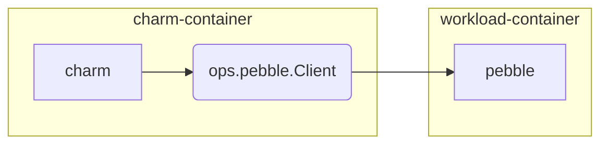
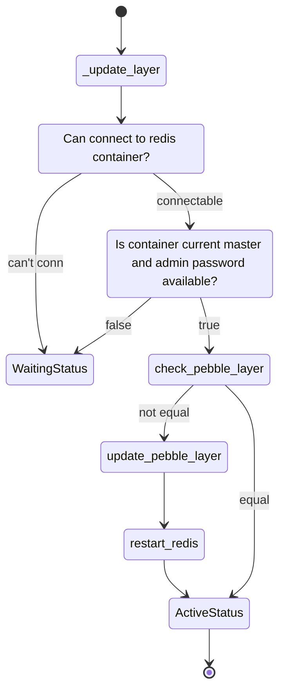
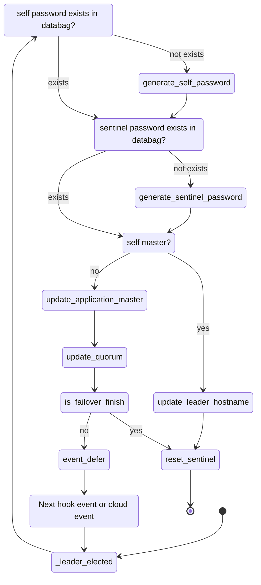

# Deployment

## agenda

* charm class
* pubble-ready
* redis-sentinel
* peers-relation
* leader-elected
* redis provider

## Create charm project and clean

```sh
$ charmcraft init -p charm-redis
```

First is `./src/charm.py`

First we should delete all `observer` function here. We will start deploy from empty class.

Also delete `containers` and `resources` in `metadata.yaml`


## Define charm(metadata.yaml)

`metadata.yaml`

First is the basic information

```yaml
name: redis-k8s
display-name: Redis
docs: https://discourse.charmhub.io/t/redis-docs-index/4571
description: >
  Redis charm for Kubernetes deployments.
tags:
  - database
  - storage
  - kubernetes
  - redis
summary: >
  Redis is an open source (BSD licensed), in-memory data structure store, used
  as a database, cache, and message broker. Redis provides data structures
  such as strings, hashes, lists, sets, sorted sets with range queries,
  bitmaps, hyperloglogs, geospatial indexes, and streams. Redis has built-in
  replication, Lua scripting, LRU eviction, transactions, and different levels
  of on-disk persistence, and provides high availability via Redis Sentinel and
  automatic partitioning with Redis Cluster.

  This charm supports Redis in Kubernetes environments, using k8s services
  for load balancing. This supports a simple Redis topology. Although multiple
  units are allowed, replication and clustering are not supported for the moment.

...
```

Then the details of our charm.

Here we define our charm which provide a redis interface. you can find interface defininatation on [charms.redis_k8s.v0.redis](https://charmhub.io/redis-k8s/libraries/redis) and [layer-index](https://github.com/juju/layer-index).

**containers**

Then we define an container name **redis**, which use oci-image resource as it's image.

And a sentinel container for HA.

**resources**

The resource **redis-image** define that we can deploy local image use command `--resource redis-image=${local_image_path}`, which is useful in local environment when the image is not publish.

Also define the certificate files for the redis server.

**storage**

Require a storage mount at `/var/lib/redis`

[details here](https://juju.is/docs/sdk/metadata-reference)

**peers**

The sentinel container is relate to redis with interface `redis-peers`

[peers relation](https://juju.is/docs/sdk/relations#heading--peer-relations)

```yaml

...

provides:
  redis:
    interface: redis

containers:
  redis:
    resource: redis-image
    mounts:
      - storage: database
        location: /var/lib/redis
  sentinel:
    resource: redis-image

resources:
  redis-image:
    type: oci-image
    description: ubuntu lts docker image for redis
    upstream: dataplatformoci/redis:7.0-22.04_edge
  cert-file:
    type: file
    filename: redis.crt
  key-file:
    type: file
    filename: redis.key
  ca-cert-file:
    type: file
    filename: ca.crt

storage:
  database:
    type: filesystem
    location: /var/lib/redis

peers:
  redis-peers:
    interface: redis-peers
```

## Charm(python class)

We are going to implement the charm's code.

First please create a empth class with the same name as the one in the `src/charm.py`(delete the old one also)
And this class should inherit `CharmBase`.  All charms written using the Charmed Operator Framework must use this abstraction.

And the basic `__init__` function. We can define basic information of the charm: juju unit name, juju application name, and the kubernetes namespace name.


```python
from ops.charm import CharmBase

class RedisK8sCharm(CharmBase):
    """Charm the service.

    Deploy a standalone instance of redis-server, using Pebble as an entry
    point to the service.
    """

    def __init__(self, *args):
        super().__init__(*args)

        self._unit_name = self.unit.name
        self._name = self.model.app.name
        self._namespace = self.model.name
```

### Charm - Pubble

Pebble is the recommended way for create a kubernetes charm.
Pebble is a lightweight, API-driven process supervisor designed to give workload containers something akin to an init system that will allow the charm container to interact with it.

It will been install on workload container(In this case is redis). You can see it under `/var/lib/pebble`

Juju will deploy charm in the sidecar container, with Pebble running as the workload container's ENTRYPOINT.



> [How to interact with Pebble](https://juju.is/docs/sdk/interact-with-pebble)

So here we need to create a pebble layer which be a supervisor of redis server.


#### observer register event

```python
class RedisK8sCharm(CharmBase):
    ...

    def __init__(self, *args):
        ...

        self.framework.observer(self.on.redis_pebble_ready, self._redis_pebble_ready)

    def _redis_pebble_ready(self, event) -> None:
        """Handle the pebble_ready event.

        Updated the Pebble layer if needed.
        """
        pass
```

We register a event `redis_pebble_ready` which handle by function `_redis_pebble_ready`


```python
from ops.model import ActiveStatus

class RedisK8sCharm(CharmBase):
    ...

    def _redis_pebble_ready(self, event) -> None:
        ...
        self._store_certificates()
        self._update_layer()

        # update_layer will set Waiting status if Pebble is not ready
        if not isinstance(self.unit.status, ActiveStatus):
            event.defer()
            return
```


#### Fetch resource from model resources, and push to container

Implement `_store_certificates` function

```python
import logging
from typing import Optional, List
from pathlib import Path
from ops.model import ActiveStatus, ModelError

logger = logging.getLogger(__name__)


class RedisK8sCharm(CharmBase):
    ...

    def __init__(self, *args):

        ...

        self._storage_path = self.meta.storages["database"].location

    def _redis_pebble_ready(self, event) -> None:
        ...

        self._store_certificates()

        ...

    def _store_certificates(self) -> None:
        """Copy the TLS certificates to the redis container."""
        # Get a list of valid paths
        cert_paths = list(filter(None, self._certificates))
        container = self.unit.get_container("redis")

        # Copy the files from the resources location to the redis container.
        for cert_path in cert_paths:
            with open(cert_path, "r") as f:
                container.push(
                    (f"{self._storage_path}/{cert_path.name}"),
                    f,
                    make_dirs=True,
                    permissions=0o600,
                    user="redis",
                    group="redis",
                )

    def _certificates(self) -> List[Optional[Path]]:
        """Paths of the certificate files.

        Returns:
            A list with the paths of the certificates or None where no path can be found
        """
        resources = ["cert-file", "key-file", "ca-cert-file"]
        return [self._retrieve_resource(res) for res in resources]

    def _retrieve_resource(self, resource: str) -> Optional[Path]:
        """Check that the resource exists and return it.

        Returns:
            Path of the reosurce or None
        """
        try:
            # Fetch the resource path
            return self.model.resources.fetch(resource)
        except (ModelError, NameError) as e:
            logger.info(e)
            return None
```

> [juju SDK - storage](https://juju.is/docs/sdk/storage)

#### Update pebble layer

Create/update pebble redis layer, it will need peer's admin password(This part will be implement later).

The state diagram, you can see the basic flow how operator bootstrap redis service by using pebble:




`src/literals.py`

> Some literals will be used later.

```python
"""Literals used by the Redis charm."""

WAITING_MESSAGE = "Waiting for Redis..."
PEER = "redis-peers"
PEER_PASSWORD_KEY = "redis-password"
SENTINEL_PASSWORD_KEY = "sentinel-password"
LEADER_HOST_KEY = "leader-host"
SOCKET_TIMEOUT = 1

REDIS_PORT = 6379
SENTINEL_PORT = 26379

CONFIG_DIR = "/etc/redis-server"
SENTINEL_CONFIG_PATH = f"{CONFIG_DIR}/sentinel.conf"
```

`src/charm.py`

```python

from ops.model import WaitingStatus, Relation
from ops.pebble import Layer
from literals import (
    PEER,
    PEER_PASSWORD_KEY,
    REDIS_PORT,
)


...

class RedisK8sCharm(CharmBase):
    ...

    def _update_layer(self) -> None:
        """Update the Pebble layer.

        Checks the current container Pebble layer. If the layer is different
        to the new one, Pebble is updated. If not, nothing needs to be done.
        """
        container = self.unit.get_container("redis")

        if not container.can_connect():
            self.unit.status = WaitingStatus("Waiting for Pebble in workload container")
            return
        if not self._valid_app_databag():
            self.unit.status = WaitingStatus("Waiting for peer data to be updated")
            return

        # Get current config
        current_layer = container.get_plan()

        # Create the new config layer
        new_layer = self._redis_layer()

        # Update the Pebble configuration Layer
        if current_layer.services != new_layer.services:
            container.add_layer("redis", new_layer, combine=True)
            logger.info("Added updated layer 'redis' to Pebble plan")
            container.restart("redis")
            logger.info("Restarted redis service")

        self.unit.status = ActiveStatus()

    def _redis_layer(self) -> Layer:
        """Create the Pebble configuration layer for Redis.

        Returns:
            A `ops.pebble.Layer` object with the current layer options
        """
        layer_config = {
            "summary": "Redis layer",
            "description": "Redis layer",
            "services": {
                "redis": {
                    "command": f"redis-server {self._redis_extra_flags()}",
                    "user": "redis",
                    "group": "redis",
                    "startup": "enabled",
                }
            },
        }
        return Layer(layer_config)

    def _redis_extra_flags(self) -> str:
        """Generate the REDIS_EXTRA_FLAGS environment variable for the container.

        Will check config options to decide the extra commands passed at the
        redis-server service.
        """
        extra_flags = [
            f"--requirepass {self._get_password()}",
            "--bind 0.0.0.0",
            f"--masterauth {self._get_password()}",
            f"--replica-announce-ip {self.unit_pod_hostname}",
        ]

        if self.config["enable-tls"]:
            extra_flags += [
                f"--tls-port {REDIS_PORT}",
                "--port 0",
                "--tls-cert-file {self._storage_path}/redis.crt",
                "--tls-key-file {self._storage_path}/redis.key",
                "--tls-ca-cert-file {self._storage_path}/ca.crt",
            ]
        # Check that current unit is master
        if self.current_master != self.unit_pod_hostname:
            extra_flags += [f"--replicaof {self.current_master} {REDIS_PORT}"]

            if self.config["enable-tls"]:
                extra_flags += ["--tls-replication yes"]
        return " ".join(extra_flags)

    def _valid_app_databag(self) -> bool:
        """Check if the peer databag has been populated.

        Returns:
            bool: True if the databag has been popilated, false otherwise
        """
        password = self._get_password()
        return bool(password and self.current_master)

    def _get_password(self) -> Optional[str]:
        """Get the current admin password for Redis.

        Returns:
            String with the password
        """
        data = self._peers.data[self.app]
        return data.get(PEER_PASSWORD_KEY)

    @property
    def _peers(self) -> Optional[Relation]:
        """Fetch the peer relation.

        Returns:
            An `ops.model.Relation` object representing the peer relation.
        """
        return self.model.get_relation(PEER)
```

Now we finish the workflow for pebble. But we still miss one thing here: Redis Sentinel.

### Redis - sentinel


* TODO: description of sentinel.py
* TODO: sentinel.py source code

### Charm - redis-peers interface

Peer relation is the recommended way to implement the relation for those distributed system like MongoDB, PostgreSQL, and ElasticSearch where clusters must exchange information amongst one another to perform proper clustering.

> More details: [Peer relation](https://juju.is/docs/sdk/relations#heading--peer-relations)

### Charm - leader elected

Because the we are going to deploy redis as redis sentinel. It will need to choose which node is the master.
This will happen in the `_leader_elected` hook.

> [leader-elected event](https://juju.is/docs/sdk/leader-elected-event)



> [juju defer event](https://juju.is/docs/sdk/deferring-events-details-and-dilemmas)

`src/sentinel.py`

`src/charm.py`

```python

...

class RedisK8sCharm(CharmBase):
    ...

    def __init__(self, *args):

        self.sentinel = Sentinel(self)
        ...
        self.framework.observe(self.on.leader_elected, self._leader_elected)

    def _leader_elected(self, event) -> None:
        """Handle the leader_elected event.

        If no passwords exist, new ones will be created for accessing Redis/Sentinel.
        This passwords will be stored on the peer relation databag.

        Additionally, there is a check for departing juju leader on scale-down operations.
        """
        if not self._get_password():
            logger.info("Creating password for application")
            self._peers.data[self.app][PEER_PASSWORD_KEY] = self._generate_password()

        if not self.get_sentinel_password():
            logger.info("Creating sentinel password")
            self._peers.data[self.app][SENTINEL_PASSWORD_KEY] = self._generate_password()
        # NOTE: if current_master is not set yet, the application is being deployed for the
        # first time. Otherwise, we check for failover in case previous juju leader was redis
        # master as well.
        if self.current_master is None:
            logger.info(
                "Initial replication, setting leader-host to {}".format(self.unit_pod_hostname)
            )
            self._peers.data[self.app][LEADER_HOST_KEY] = self.unit_pod_hostname
        else:
            # TODO extract to method shared with relation_departed
            self._update_application_master()
            self._update_quorum()
            try:
                self._is_failover_finished()
            except (RedisFailoverCheckError, RedisFailoverInProgressError):
                logger.info("Failover didn't finish, deferring")
                event.defer()
                return

            logger.info("Resetting sentinel")
            self._reset_sentinel()

    def get_sentinel_password(self) -> Optional[str]:
        """Get the current password for sentinel.

        Returns:
            String with the password
        """
        data = self._peers.data[self.app]
        return data.get(SENTINEL_PASSWORD_KEY)

    def _update_application_master(self) -> None:
        """Use Sentinel to update the current master hostname."""
        info = self.sentinel.get_master_info()
        logger.debug(f"Master info: {info}")
        if info is None:
            logger.warning("Could not update current master")
            return

        self._peers.data[self.app][LEADER_HOST_KEY] = info["ip"]

    def _update_quorum(self) -> None:
        """Connect to all Sentinels deployed to update the quorum."""
        command = f"SENTINEL SET {self._name} quorum {self.sentinel.expected_quorum}"
        self._broadcast_sentinel_command(command)

    def _reset_sentinel(self):
        """Reset sentinel to process changes and remove unreachable servers/sentinels."""
        command = f"SENTINEL RESET {self._name}"
        self._broadcast_sentinel_command(command)

    def _broadcast_sentinel_command(self, command: str) -> None:
        """Broadcast a command to all sentinel instances.

        Args:
            command: string with the command to broadcast to all sentinels
        """
        hostnames = [self._k8s_hostname(unit.name) for unit in self._peers.units]
        # Add the own unit
        hostnames.append(self.unit_pod_hostname)

        for hostname in hostnames:
            with self.sentinel.sentinel_client(hostname=hostname) as sentinel:
                try:
                    logger.debug("Sending {} to sentinel at {}".format(command, hostname))
                    sentinel.execute_command(command)
                except (ConnectionError, TimeoutError) as e:
                    logger.error("Error connecting to instance: {} - {}".format(hostname, e))

```


### Charm - Interface

Because we are going to implement the [redis interface](https://charmhub.io/redis-k8s/libraries/redis).
We can use charmcraft to download the lib from charmhub. The lib will be download in the **lib** folder.

```sh
$ charmcraft fetch-lib charms.redis-k8s.v0.redis
$ tree
.
├── actions.yaml
├── charmcraft.yaml
├── config.yaml
├── CONTRIBUTING.md
├── lib
│   └── charms
│       └── redis_k8s
│           └── v0
│               └── redis.py
├── LICENSE
├── metadata.yaml
├── README.md
├── requirements-dev.txt
├── requirements.txt
├── run_tests
├── src
│   └── charm.py
└── tests
    ├── __init__.py
    └── test_charm.py
```

Then register our charm class as redis provider.


```python
from charms.redis_k8s.v0.redis import RedisProvides
from literals import REDIS_PORT

class RedisK8sCharm(CharmBase):
    ...

    def __init__(self, *args):
	...
	self.redis_provides = RedisProvides(self, port=REDIS_PORT)
```

`src/literals.py`

```python
"""Literals used by the Redis charm."""

REDIS_PORT = 6379
```


Lets look at the interface details: `lib/charms/redis_k8s/v0/redis.py`.
We need to provide the 

We need to implement `current_master` function to make this interface available.

```python
...

class RedisProvides(Object):
    def __init__(self, charm, port):
        """A class implementing the redis provides relation."""
        super().__init__(charm, "redis")
        self.framework.observe(charm.on.redis_relation_changed, self._on_relation_changed)
        self._port = port
        self._charm = charm

    def _on_relation_changed(self, event):
        """Handle the relation changed event."""
        event.relation.data[self.model.unit]['hostname'] = self._get_master_ip()
        event.relation.data[self.model.unit]['port'] = str(self._port)
        # The reactive Redis charm also exposes 'password'. When tackling
        # https://github.com/canonical/redis-k8s/issues/7 add 'password'
        # field so that it matches the exposed interface information from it.
        # event.relation.data[self.unit]['password'] = ''

    def _bind_address(self, event):
        """Convenience function for getting the unit address."""
        relation = self.model.get_relation(event.relation.name, event.relation.id)
        if address := self.model.get_binding(relation).network.bind_address:
            return address
        return self.app.name

    def _get_master_ip(self) -> str:
        """Gets the ip of the current redis master."""
        return socket.gethostbyname(self._charm.current_master)
```

It will register a `_on_relation_changed` function to event `redis_event_change`.
Operator framework use the observer pattern to handle to lifecycle.
Which means if juju agent on the unit get the event `redis_relation_changed`, it will fire the function `_on_relation_changed`.


`./src/charm.py`

```python
...

class RedisK8sCharm(CharmBase):
    ...

    @property
    def current_master(self) -> Optional[str]:
        """Get the current master."""
        return self._peers.data[self.app].get(LEADER_HOST_KEY)
```

## References

* https://redis.io/docs/manual/sentinel/
